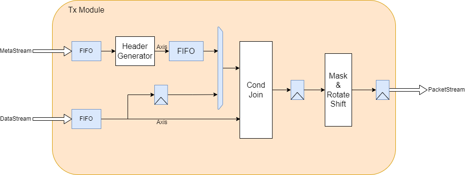
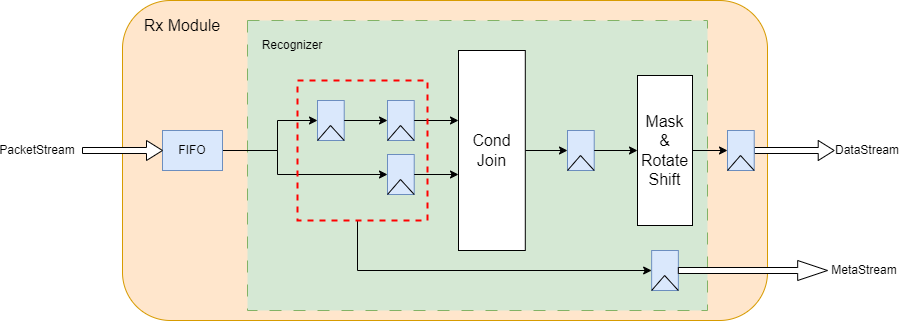
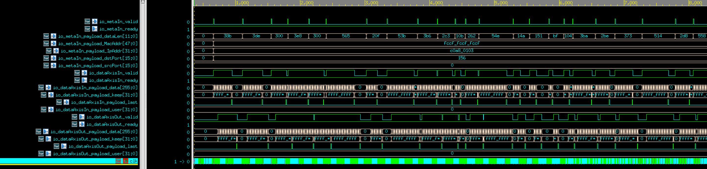

# SpinalHDL-UDP/IP Component
## Introduction
- The goal of this project is to create a UDP/IP Tx/Rx Component with SpinalHDL for Xilinx 100GbE Ethernet-Subsystem (MRMAC/CMAC).
- the module support following features:
  - UDP Tx/Rx without checksum
  - IP Tx/Rx 
  - Ethernet Frame Layer2 (pre-add MAC adn EtherType)
  - 256b data width
  - Fully pipeline
## Diagram

## Top Module I/O description

There is the specification of Tx I/O:

| IO name     | direction | type                                   | description                                               |
|-------------|-----------|----------------------------------------|-----------------------------------------------------------|
| metaIn      | slave     | Stream(MetaInterface)                  | Stream of meta to config the following transaction        |
| dataAxisIn  | slave     | Stream(Axi4StreamBundle)[tKeep, tLast] | Stream of data                                            |
| dataAxisOut | master    | Stream(Axi4StreamBundle)[tKeep, tLast] | Stream of packet which has inserted ethernet frame header |

There is the specification of Rx I/O:

| IO name     | direction | type                                   | description                                              |
|-------------|-----------|----------------------------------------|----------------------------------------------------------|
| dataAxisIn  | slave     | Stream(Axi4StreamBundle)[tKeep, tLast] | Stream of ethernet frame packet                          |
| metaOut     | master    | Stream(MetaInterface)                  | Stream of meta about this transaction                    |
| dataAxisOut | master    | Stream(Axi4StreamBundle)[tKeep, tLast] | Stream of data which has unpacked from ethernet protocol |

## A Simple Verification
 

## TODO
- Redesign Rx module control logic
- ARP request module
- ICMP module
- Data Width support 384b/512b
- Use Cocotb for verification