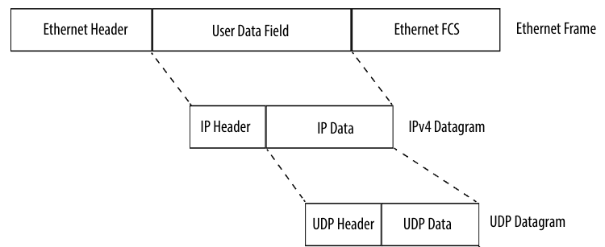
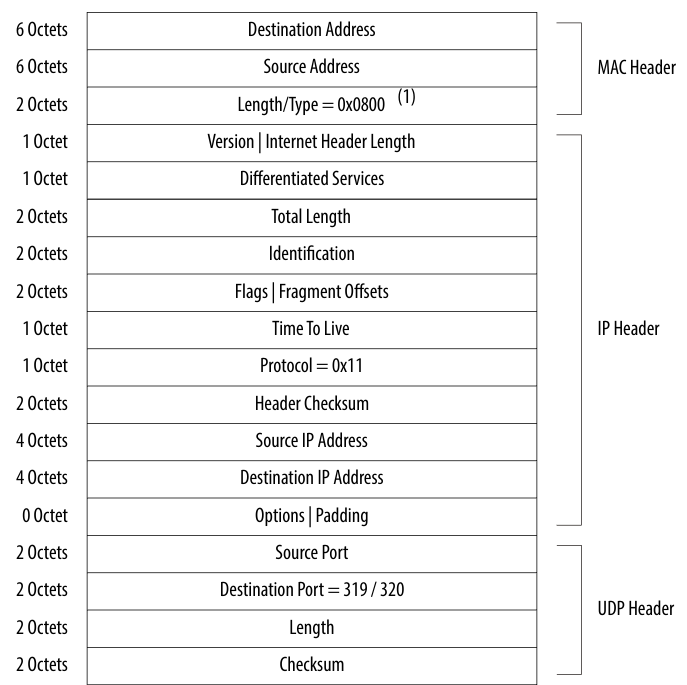

# SpinalHDL-UDP/IP Component
## Introduction
- The goal of this project is to create a UDP/IP Tx/Rx Component with SpinalHDL for Xilinx 100GbE Ethernet-Subsystem (MRMAC/CMAC).
- the module support following features:
  - UDP Tx/Rx without checksum
  - IP Tx/Rx
  - Ethernet Frame Layer2 (pre-add MAC adn EtherType)
  - 256b data width
  - Fully pipeline

## Overview
UDP is a connectionless protocol and does not guarantee the delivery of data sent, thus leaving the whole control mechanism and error-checking functions to the application itself.

Before implementing the UDP layer, it is also necessary to build the IP Layer and MAC Layer. This is because the UDP layer is packed in the IP layer, and the IP layer is embedded in the MAC layer. The following figure is about the network packet structure sent by Ethernet UDP.

## Design Details
The following two structural block diagrams are about the architecture design of UDP Tx and Rx module.

In the Tx Module, configuration information and data flow need to be received separately. Among them, the data flow information sent each time needs to be accompanied by a piece of configuration information. Since the FIFO buffer is added to the input ports, there is no requirement for the arrival order of data information and configuration information (two data streams arrive simultaneously to obtain the maximum bandwidth). After successfully receiving the configuration information, HeaderGenerator will generate the corresponding Ethernet packet header. It should be noted that since the UDP Checksum is set to 0 by default in the current design, the sender will not perform the checksum calculation. After the packet header is generated, it will be automatically input into the buffer FIFO and inserted before the data stream after waiting for the arrival of the data stream. Since the data bit width of the Ethernet header is 42B(14B MAC + 20B IP + 8B UDP), under different data bit width settings, there is one beat of data that lacks data, and data flow is needed to fill it here. (Ethernet byte order needs to be satisfied during the padding process, which will be guaranteed in subsequent shifts)

In order to satisfy the filling of the packet header bit width information, the incoming data needs to be buffered for one beat, which is realized by `Stage()` after `StreamFork()`. In `SubStreamJoin`, `SelectedStream` is used as the mainStream, and `dataStream` is used as the subStream. This is because the `headerStream` needs to be sent independently when the current shot does not need `dataStream` for filling.

In addition, since the UDP module is currently used with Xilinx MAC IP, the Preamble, SFD, FCS, and IPG of the MAC Layer will not be added to the UDP module. The Ethernet subsystem of Xilinx can realize the MAC Layer function. UDP only needs to be completed after transferring the packed address information, protocol information, and data information to Xilinx MAC IP.

In the Rx module, it is mainly to identify the protocol frame header of the data packet, judge whether the protocol or address is correct, and whether it needs to be ignored. Received Ethernet data is first buffered into FIFO.

In the block diagram of the receiving module above, the buffer register contained in the red dotted line identifies and extracts the information of the current data packet within one clock cycle (the configuration of the current block diagram is 256b; when the data bit width is 512b, only one channel needs to be buffered; when the data bit width is 128b, 3 channels need to be buffered).

After successfully obtaining the current configuration information, send it out. At the same time, the packet header information is discarded, and the data information is retained. Since the discarded packet header information will make the data in the current clock cycle empty, it needs to be filled with the buffered data, which is controlled by `subStreamJoin()`. After splicing is completed, `rotateShift()` is required to ensure the network byte order.

## Top Module I/O description

There is the specification of Tx I/O:

| IO name     | direction | type                                   | description                                               |
|-------------|-----------|----------------------------------------|-----------------------------------------------------------|
| metaIn      | slave     | Stream(MetaInterface)                  | Stream of meta to config the following transaction        |
| dataAxisIn  | slave     | Stream(Axi4StreamBundle)[tKeep, tLast] | Stream of data                                            |
| dataAxisOut | master    | Stream(Axi4StreamBundle)[tKeep, tLast] | Stream of packet which has inserted ethernet frame header |

There is the specification of Rx I/O:

| IO name     | direction | type                                   | description                                              |
|-------------|-----------|----------------------------------------|----------------------------------------------------------|
| dataAxisIn  | slave     | Stream(Axi4StreamBundle)[tKeep, tLast] | Stream of ethernet frame packet                          |
| metaOut     | master    | Stream(MetaInterface)                  | Stream of meta about this transaction                    |
| dataAxisOut | master    | Stream(Axi4StreamBundle)[tKeep, tLast] | Stream of data which has unpacked from ethernet protocol |

## A Simple Verification

## TODO
- [x] Redesign Rx module control logic
- [ ] Use Cocotb for verification
- [ ] ARP request module
- [ ] ICMP module
- [x] Data Width support 128b/256b/512b